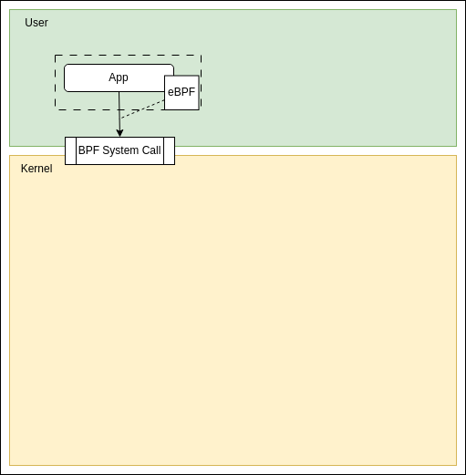

# EBPF
###### TechTalk 28/07/2023

---

## Agenda

* What is eBPF
* How eBPF works
* Usages

---

## Disclamer

* Not a kernel expert &#128517;
* Never write eBPF program &#128533;
* I'm an impostor &#128561;

---

## What is eBPF

* Extension of Berklet Packet Filter (<a href="http://www.tcpdump.org/papers/bpf-usenix93.pdf">92'</a>)
* Program loaded & executed in the kernel space
* Extend the capabilities of the kernel
  * safely
  * efficiently
  * without kernel changes &#128559;

---

## Even Driven

* eBPF programs executed on an event
  * Network event
  * System calls
  * Tracepoints
  * Kernel Probes
  * ...

--

## Program types

* Mainly API for eBPF program
  * Define where the program can be loaded in the kernel
  * Limit the events
  * Define the data structures
  * Limit the <a href="https://man7.org/linux/man-pages/man7/bpf-helpers.7.html">Helpers function</a> accessible

--

## Languages

* Mainly C based 
* Rust is an option
* LLVM/Clang to generate the BPF ByteCode
* Python with BCC for tracing oriented program 

--

## Workflow

--

## Workflow

--

## Workflow

--

## Workflow

1

--

## Workflow

1

--

## Workflow

--

## Workflow

--

## Workflow

---

## Demo

* BCC / <a href="https://github.com/iovisor/bcc/blob/v0.2.0/tools/tcpconnect.py">tcpconnect</a>

---

## Use Cases

* Networking
* Security
* Observability

---

## Networking

* Traffic Shaping
* Packet filtering
* Socket Mapping
* TCP Congession Control callback
* ...

--

## Networking Stack

--

## Networking Stack Hooks

--

## Kubernetes Networking

--

## Kubernetes Networking

---

## Security

* DDoS Mitigation
* System Audit
* Enforce system security

--

## DDoS Mitigation

* Based on eXpress Data Path
* Drop malicious packages as soon as possible
* Used by <a href="https://blog.cloudflare.com/l4drop-xdp-ebpf-based-ddos-mitigations/">Cloudflare</a> for example

--

## Enforce system security

* Mitigate kernel vulns
* Prevent actions (File access, Program execution...)
* <a href="https://tetragon.cilium.io/">Cilium Tetragon</a>

---

## Observability

* Observability tools already exist
* eBPF tools are more efficiant 
  * do not rely on /proc
  * values aggregated in kernel space

--

## What can we observe ?

--

## px.dev

* Observability tool for Kubernetes applications
* eBPF to automatically capture telemetry data
* Scriptable using <a href="https://github.com/iovisor/bpftrace">bpftrace</a>

---

### Conclusion

* eBPF is powerful
* Not new but 
  * constantly evolving
  * more and more present in the landscape
* Need good knowledges about kernel and related stuffs

---

## Resources

* <a href="https://lwn.net/Articles/740157/">A thorough introduction to eBPF</a>
* How Datadog fixed network issue using <a href="https://www.youtube.com/watch?app=desktop&v=lPJfceYtS6Y">XDP/Cilium</a>
* Man page of <a href="https://man7.org/linux/man-pages/man2/bpf.2.html">bpf</a>
* Man page of <a href="https://man7.org/linux/man-pages/man7/bpf-helpers.7.html">Helper functions</a>
* Tour of <a href="https://blogs.oracle.com/linux/post/bpf-a-tour-of-program-types">program types</a>
* <a href="https://ebpf.io">ebfp.io</a>