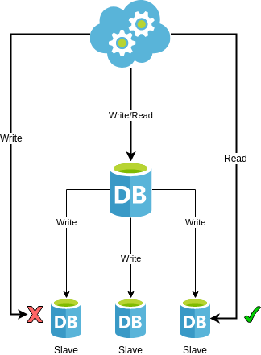
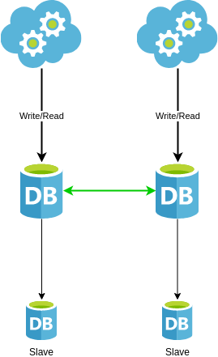
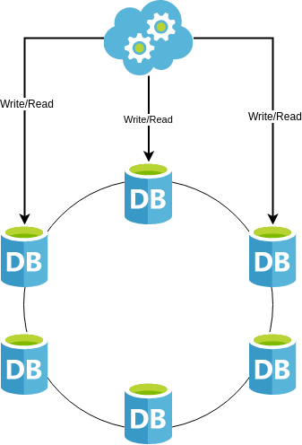
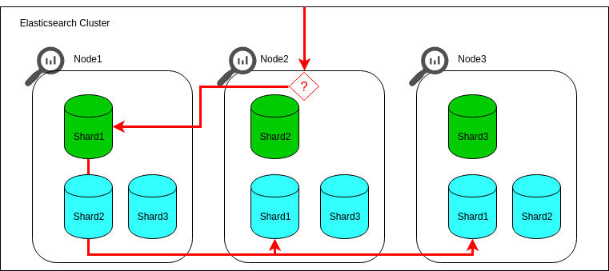
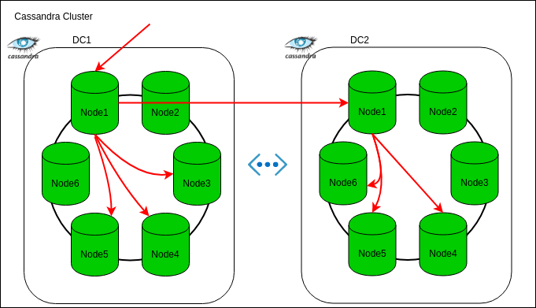
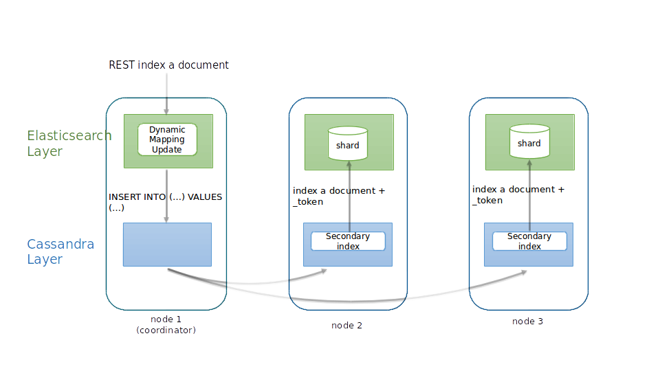
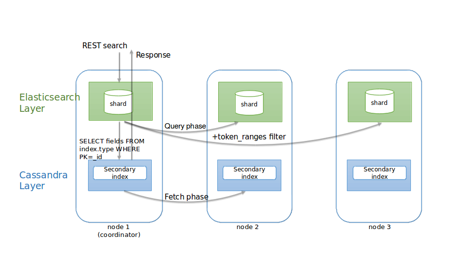
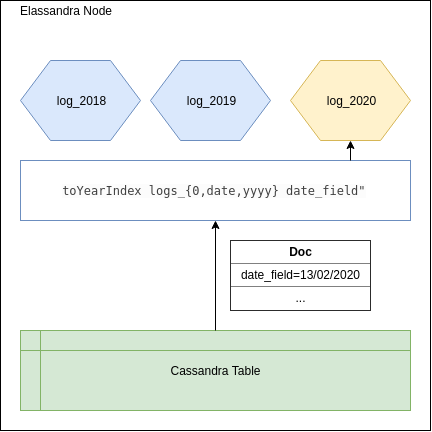
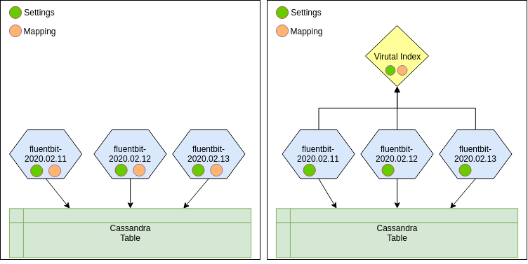

# Elassandra
#### Micro-Services Database
###### BBTex 12/03/2020

---

## $ Whoami

* Eric Leleu
* @leleueri

---

## Agenda

* Data Requirements
* Data Replication
* ElasticSearch
* Apache Cassandra
* Elassandra
* Demo

---

## Data Requirements

* Availability
* Scalability
* Searchability
* Analyze & Processing

---


--

## Master/Slave

<table>
    <tr>
        <td scope="col"></td>
        <td scope="col"><small>
            <ul>
                <li>Synchronous Replication:
                    <ul>
                        <li>No Writes Availabbility</li>
                    </ul>
                </li>   
                <li>Asynchronous Replication:
                    <ul>
                        <li>Slave may have stale data</li>
                    </ul>
                </li> 
                <li>Manual Failover:
                    <ul>
                        <li>Writes impossible for a while</li>
                    </ul>
                </li> 
                <li>Automatic Failover:
                    <ul>
                        <li>Split Brain may occur (two masters)</li>
                    </ul>
                </li> 
            </ul></small>
        </td>
    </tr>
</table>

--

## Multi-Master

<table>
    <tr>
        <td scope="col"></td>
        <td scope="col"><small>
            <ul>
            <li> Master/Slave with Better availability</li>
            <li> But :
                <ul>
                    <li>May be complex according to topology</li>
                    <li>May have conflicts</li> 
                </ul>
            </li>
            </ul></small>
        </td>
    </tr>
</table>

--

## Masterless

<table>
    <tr>
        <td scope="col"></td>
        <td scope="col"><small>
            <ul>
                <li>R/W High Availability (No SPOF)</li>
                <li>App developers responsible of consistency</li>
                <li>Anti-entropy/Synchro</li>
                <li>Conflicts : Last Write Win</li>
            </ul></small>
        </td>
    </tr>
</table>

---

## ElasticSearch



<!-- https://www.elastic.co/guide/en/elasticsearch/reference/current/docs-replication.html -->

--

## ElasticSearch

* FullText Search
* Spatial Search 
* Real-time Aggregation  
* No MultiDC replication in OSS 

<!-- https://www.elastic.co/fr/blog/follow-the-leader-an-introduction-to-cross-cluster-replication-in-elasticsearch -->

--

## ElasticSearch: Summary

| Requirements         |     |
|----------------------|-----|
| Availability         |  ++ |
| Scalability          |  +  |
| Multi DC             |  -  |
| Searchability        | +++ |
| Analyze & Processing | +++ |

---

## Apache Cassandra



--

## Apache Cassandra

* Distributed Hash Table
* Query with partition key
* Secondary indices are limited
* Aggregation possible but limited

--

## Apache Cassandra: Summary

| Requirements         |     |
|----------------------|-----|
| Availability         | +++ |
| Scalability          | +++ |
| Multi DC             | +++ |
| Searchability        |  +  |
| Analyze & Processing |  +  |

---

## Elassandra


--

## Elassandra

* Elastic & Cassandra tightly coupled
  * Single Cluster to manage
  * No sync plumbing
  * No duplicate data
* Real-time search & Analytics
* Effortless scale
* High-Avalability & Multi-DC
* Cloud-agnostic or On-Premise

--


--

## Write Path



--

## Read Path



--

## Bi-Directionnal Mapping

* Adapt CQL Schema according to Document Fields
* Discover ElasticSearch mapping base on CQL Schema

--

## Nested Document

* Nested documents are stored in a Cassandra User Defined Type
* UDT dynamically generated from the Elasticsearch mapping.

--

## CQL Extension

ElasticSearch queries though CQL

```markdown
cassandra@cqlsh> SELECT * FROM twitter.tweet WHERE 
                          es_query='{ "query": 
                             {"query_string": {"query":"bar2*"}}
                          }';
```

--

## Multiple Indices

* On single Keyspace
* On single table
  * Partition Indices
  * Virtual Indices

--

## Partitionned Indices



--

## Virtual Indices



--

### Ecosystem

* Compatible with Elasticsearch stack
  * Kibana
  * Logstash
* Compatible with Cassandra environment
  * Apache Spark
  * Cassandra Reaper

--

## Elassandra : Summary

| Requirements         |     |
|----------------------|-----|
| Availability         | +++ |
| Scalability          | +++ |
| Multi DC             | +++ |
| Searchability        | +++ |
| Analyze & Processing | +++ |

--

## Elassandra Enterprise

* ElasticSearch API security
  * SSL
  * Auth & Authz
  * Content-Based Security
* Audit logs
* Join Queries
* JMX Support
* Backup & Restore

---

## Demo

---

## Q&A

<small> [@leleueri](https://twitter.com/leleueri) </small>
<br />
<small>http://strapdata.com/contact/</small>
